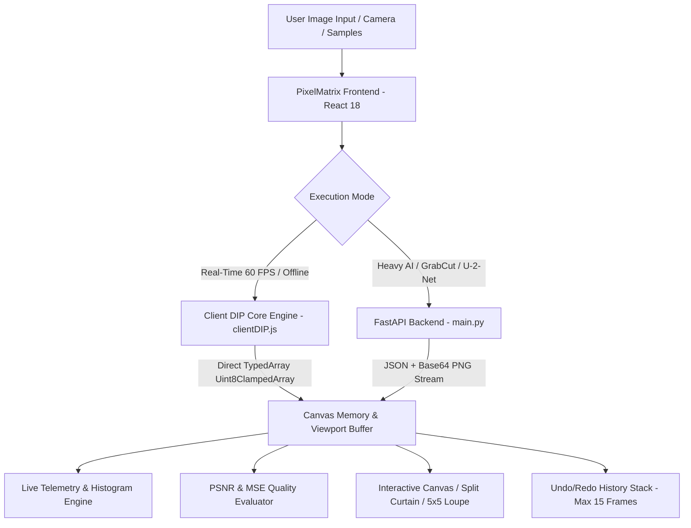

# معمارية النظام وتدفق البيانات (System Architecture & Pipeline)

---

## 1. النظرة المعمارية العامة (Architectural Overview)

يعتمد مشروع **PixelMatrix** على معمارية هجينة متقدمة تُعرف بـ **Dual-Engine Hybrid Architecture**. 

تم تصميم المعمارية لتجمع بين السرعة الفورية لمعالجة المصفوفات في المتصفح عبر معايير **HTML5 Canvas 2D Context**، وبين القوة الحسابية لمكتبات الرؤية الحاسوبية الصناعية في بيئة **Python (OpenCV + NumPy + FastAPI)**.



---

## 2. هيكلية المكونات البرمجية للواجهة (Component Tree)

تتبع الواجهة الأمامية هيكلية شجرية معيارية ومنظمة:

```text
src/
├── App.jsx                       # المكون الجذري وموجه الشاشات ومخزن الحالة المركزي
├── main.jsx                      # نقطة الدخول وتهيئة React DOM
├── components/
│   ├── WelcomeScreen.jsx         # شاشة الترحيب وإطلاق الاستوديو وهوية الفريق والمشرف
│   ├── Navbar.jsx                # الشريط العلوي، اختصارات التراجع، التكبير، والتنقل
│   ├── Sidebar.jsx               # شريط الأدوات الجانبي العائم (Tool Rail)
│   ├── CanvasArea.jsx            # مساحة العرض التفاعلية، الستارة المقارنة، والعدسة 5x5
│   ├── RightPanel.jsx            # لوحة التحكم السياقية وبطاقة الـ Processing Info HUD
│   ├── PassportStudio.jsx        # استوديو فحص الوضعيات البيومترية الثلاث وطباعة الكروت
│   ├── TeamHeroModal.jsx         # نافذة بطاقات التعريف بأعضاء الفريق الثلاثة
│   └── HelpModal.jsx             # نافذة دليل الاستخدام والمساعدة الأكاديمية
└── services/
    ├── clientDIP.js              # النواة الحسابية المحلية (Canny, Median, Arithmetic, etc.)
    └── api.js                    # واجهة الاتصال غير المتزامن بالخادم الخلفي FastAPI
```

---

## 3. خط أنابيب معالجة الصورة (Image Processing Pipeline)

### 3.1 مرحلة الإدخال (Ingestion Phase)
- تقبل المنصة مدخلات متعددة: ملفات محلية (JPEG, PNG, WebP)، أو التقاط كاميرا الويب المباشرة، أو عينات اختبارية فورية محملة مسبقاً (`/sample-product.svg`, `/test-pose.jpg`).
- يتم تحويل الصورة تلقائياً إلى كائن صورة متصفح ($Image$) واستخراج أبعادها الطبيعية ($naturalWidth \times naturalHeight$).

### 3.2 مرحلة النطاق المكاني (Spatial Manipulation Phase)
- يتم رسم الصورة داخل كانفاس مخفي غير مصير (Off-screen Canvas) بنفس أبعادها الحقيقية.
- يتم استخراج مصفوفة البكسلات الخام ذات القنوات الأربع عبر `ctx.getImageData(0, 0, w, h)`.
- تمثل هذه البيانات مصفوفة خطية أحادية البعد ذات أطوال متتالية:
  $$Index = (y \cdot W + x) \cdot 4 + \text{channel}$$
  حيث تمثل القنوات: $0 \to Red, 1 \to Green, 2 \to Blue, 3 \to Alpha$.

### 3.3 مرحلة التنفيذ الخوارزمي (Algorithmic Execution)
- تمرر المصفوفة إلى الدالة الرياضية المطلوبة (مثل `applyCannyEdge`, `applyMedianFilter`, `applyImageArithmetic`).
- تجري الحسابات مباشرة باستخدام مصفوفات جافاسكريبت المكتوبة عدادياً (**Typed Arrays** مثل `Uint8ClampedArray` و `Float32Array` و `Int32Array`) لتحقيق أعلى أداء حسابي ممكن (Zero Object Allocation Overhead).

### 3.4 مرحلة إعادة التصيير والـ Telemetry
- تعاد المصفوفة الناتجة إلى الكانفاس عبر `ctx.putImageData()`.
- يتم استخراج رابط الصورة المصيرة $toDataURL('image/png')$ وإضافته لمكدس التاريخ.
- يستجيب محرك الهستوجرام فوراً لحساب توزيع الـ 32 حزمة (32 bins) على القنوات الثلاث وقناة الإضاءة.
- يتم تحديث بطاقة **Processing Info HUD** بكافة تفاصيل المعالجة وزمن التنفيذ (Latency).

---

## 4. معمارية الخادم الخلفي (FastAPI & OpenCV Architecture)

يتكون الخادم الخلفي من هيكلية برمجية منظمة عبر مسارات FastAPI:

```text
backend/
├── main.py                       # تطبيق FastAPI ونقاط النهاية المركزية وفحص الجاهزية
├── requirements.txt              # المتطلبات: fastapi, uvicorn, opencv-python, numpy
└── routers/
    ├── pixel_ops.py              # مسارات العمليات النقطية والهستوجرام
    ├── spatial_ops.py            # مسارات الالتفاف المكاني وكاشف كاني
    └── ai_ops.py                 # مسارات عزل الخلفية U-2-Net واستوديو المنتجات
```

---

## 5. ميكانيكية العمل الذاتي والاحتياطي (Graceful Degradation & Fallback)

1. عند بدء التشغيل، يرسل التطبيق طلب فحص صحة (`/health`) إلى خادم الـ Backend.
2. إذا كان الخادم قيد التشغيل، تظهر نقطة الاتصال الخضراء وزمن استجابة الشبكة.
3. إذا كان الخادم متوقفاً أو واجه المستخدم مشكلة في الشبكة، تتحول المنصة بسلاسة إلى **وضع المحرك المحلي المستقل (100% Client-Side Engine)** دون أن يتعطل أي زر أو تظهر أي شاشة خطأ، مما يضمن نجاح مناقشة المشروع في أي بيئة تشغيلية دون مفاجآت تقنية.

---
