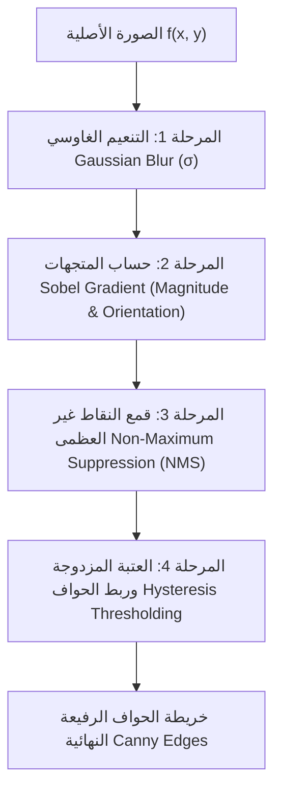
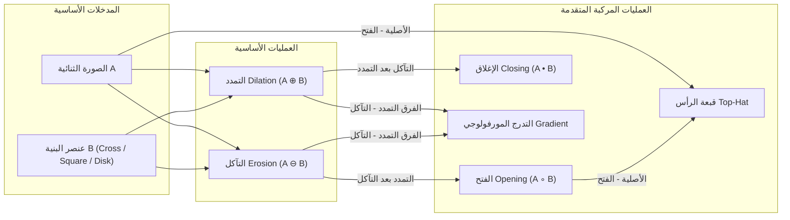

# الدليل الشامل للخوارزميات الرياضية (PixelMatrix Algorithms Reference)

يقدم هذا التوثيق تفصيلاً رياضياً وهندسياً دقيقاً لكافة الخوارزميات المنفذة في محرك **PixelMatrix** (`clientDIP.js`)، مع المعادلات الرياضية، وشرح منطق التنفيذ البرمجي، وتحديد معاملات الضبط ونطاقاتها.

---

## 1. العمليات النقطية وتحسين الشدة (Point Operations & Intensity Transformations)

تعمل هذه الفئة من الخوارزميات وفق الدالة التحويلية $s = T(r)$ حيث $r$ هي قيمة بكسل الإدخال، و $s$ هي قيمة بكسل الإخراج.

### 1.1 الصورة السالبة (Image Negative / Inversion)
- **المعادلة الرياضية:**
  $$s = L - 1 - r = 255 - r$$
- **التطبيق العملي:** تحسين التفاصيل الدقيقة البيضاء في المناطق الداكنة الكبيرة، ومحاكاة صور الأشعة السينية (X-Ray).
- **التنفيذ البرمجي:**
  ```javascript
  output[i] = 255 - input[i];       // R
  output[i+1] = 255 - input[i+1];   // G
  output[i+2] = 255 - input[i+2];   // B
  ```

### 1.2 التحويل اللوغاريتمي (Logarithmic Transformation)
- **المعادلة الرياضية:**
  $$s = c \cdot \log(1 + r)$$
  حيث يحسب ثابت القياس $c$ لضمان امتداد المدى الديناميكي الكامل إلى $[0, 255]$:
  $$c = \frac{255}{\log(1 + \max(r))} = \frac{255}{\log(256)} \approx 45.986$$
- **التطبيق العملي:** توسيع البكسلات الداكنة وضغط البكسلات الساطعة ذات المدى الديناميكي العالي، ويستخدم قياسياً لإظهار أطياف فورييه (Fourier Spectra).
- **التنفيذ البرمجي:**
  ```javascript
  const c = 255 / Math.log(256);
  output[i] = c * Math.log(1 + input[i]);
  ```

### 1.3 تحويل قانون القوة / تصحيح غاما (Power-Law / Gamma Correction)
- **المعادلة الرياضية:**
  $$s = c \cdot r^\gamma \implies s = 255 \cdot \left(\frac{r}{255}\right)^\gamma$$
- **التطبيق العملي:**
  - $\gamma < 1$ (غاما منخفضة): تفتيح المناطق المظلمة وإبراز تفاصيل الظلال دون حرق البكسلات الفاتحة.
  - $\gamma > 1$ (غاما مرتفعة): تعميق التباين وتعتيم المناطق المبيضة (Overexposed Images).
- **المعاملات:** $\gamma \in [0.1, 5.0]$ (الافتراضي: 1.0).

### 1.4 تمدد التباين الخطي (Contrast Stretching)
- **المعادلة الرياضية:**
  $$s = \frac{r - r_{min}}{r_{max} - r_{min}} \times 255$$
  حيث $r_{min}$ و $r_{max}$ هما أدنى وأعلى قيمة شدة في الصورة الأصلية.
- **التطبيق العملي:** استعادة التباين الكامل للصور الباهتة (Low-Contrast) الناتجة عن سوء الإضاءة أو ضبابية العدسة.

### 1.5 تقطيع المستويات البتية (Bit-Plane Slicing)
- **المعادلة الرياضية:**
  تُمثل قيمة البكسل ذي الـ 8 بتات كجمع ثنائي:
  $$r = b_7 2^7 + b_6 2^6 + b_5 2^5 + b_4 2^4 + b_3 2^3 + b_2 2^2 + b_1 2^1 + b_0 2^0$$
  يتم استخلاص المستوى البتي $k$ ($k \in [0, 7]$) عبر قناع البتات (Bitwise AND):
  $$s_k = \begin{cases} 255 & \text{if } (r \ \& \ 2^k) \ne 0 \\ 0 & \text{otherwise} \end{cases}$$
- **التطبيق العملي:** تحليل المساهمة الهيكلية لكل بت؛ حيث يحتوي البت 7 (MSB) على معظم المعلومات البصرية الأساسية، بينما يمثل البت 0 (LSB) ضوضاء عشوائية مثالية لتشفير البيانات المخفية (Steganography).

### 1.6 مساواة المدرج التكراري (Histogram Equalization)
- **المعادلة الرياضية:**
  حساب دالة التوزيع التراكمي (Cumulative Distribution Function - CDF):
  $$s_k = T(r_k) = \text{round}\left( \frac{\text{CDF}(r_k) - \text{CDF}_{min}}{(M \cdot N) - \text{CDF}_{min}} \times (L - 1) \right)$$
- **التطبيق العملي:** التوزيع المنتظم لمستويات السطوع على كامل النطاق الرمادي لرفع التباين العام تلقائياً دون تدخل يدوي.

---

## 2. الفلاتر المكانية والالتفاف (Spatial Linear Filtering & Convolution)

تعتمد على تمرير نواة مصفوفية $h$ أبعادها $K \times K$ فوق الصورة:
$$g(x, y) = \sum_{s=-a}^a \sum_{t=-b}^b h(s, t) f(x-s, y-t)$$

### 2.1 فلتر الصندوق المتوسط (Mean / Box Filter)
- **المصفوفة ($3\times3$):**
  $$h_{box} = \frac{1}{9} \begin{bmatrix} 1 & 1 & 1 \\ 1 & 1 & 1 \\ 1 & 1 & 1 \end{bmatrix}$$
- **التطبيق:** إزالة الضوضاء العشوائية البسيطة مع حدوث تعتيم (Blurring) متساوي للحواف.

### 2.2 الفلتر الغاوسي (Gaussian Blur Filter)
- **المعادلة الرياضية لتوليد النواة:**
  $$G(x, y) = \frac{1}{2\pi \sigma^2} e^{-\frac{x^2 + y^2}{2\sigma^2}}$$
- **التطبيق العملي:** تنعيم فيزيائي طبيعي يمنح البكسلات المركزية وزناً أكبر من البكسلات البعيدة، مما يقلل الضوضاء مع الحفاظ الأفضل على تماسك الحواف مقارنة بالفلتر المتوسط.

### 2.3 مؤثر لابلاسيان وزيادة الحدة (Laplacian & Highboost Filtering)
- **مصفوفة المشتقة الثانية (Laplacian Kernel):**
  $$h_{lap} = \begin{bmatrix} 0 & -1 & 0 \\ -1 & 4 & -1 \\ 0 & -1 & 0 \end{bmatrix} \quad \text{أو} \quad \begin{bmatrix} -1 & -1 & -1 \\ -1 & 8 & -1 \\ -1 & -1 & -1 \end{bmatrix}$$
- **معادلة Highboost Sharpening:**
  $$f_{hb} = A \cdot f(x, y) - f_{smooth}(x, y) = (A - 1) \cdot f(x, y) + f_{lap}(x, y)$$
  حيث $A \ge 1$. عند $A=1$ تسمى العملية Unsharp Masking، وعند $A > 1$ تسمى Highboost.

### 2.4 كواشف التدرج سوبيل وبريويت (Sobel & Prewitt Gradient Operators)
- **مصفوفات سوبيل (Sobel Kernels):**
  $$G_x = \begin{bmatrix} -1 & 0 & 1 \\ -2 & 0 & 2 \\ -1 & 0 & 1 \end{bmatrix}, \quad G_y = \begin{bmatrix} -1 & -2 & -1 \\ 0 & 0 & 0 \\ 1 & 2 & 1 \end{bmatrix}$$
- **مقدار وزاوية التدرج:**
  $$M(x, y) = \sqrt{G_x^2 + G_y^2} \approx |G_x| + |G_y|, \quad \theta(x, y) = \arctan\left(\frac{G_y}{G_x}\right)$$

---

## 3. كاشف حواف كاني متعدد المراحل (True Canny Edge Detector)

يعتبر كاشف كاني الأمثل رياضياً (Optimal Edge Detector) وفق معايير John F. Canny الثلاثة:
1. انخفاض معدل الخطأ (Low Error Rate).
2. دقة تحديد موضع الحافة (Edge Localization).
3. استجابة وحيدة لكل حافة (Single Response to Single Edge).



### 3.1 المرحلة 1: التنعيم الغاوسي (Gaussian Smoothing)
ترشيح الصورة بنواة غاوسية ($5\times5$ أو حسب $\sigma$) للتخلص من الترددات العالية المشوشة التي قد تنتج حوافاً زائفة:
$$I_\sigma(x, y) = f(x, y) * G_\sigma(x, y)$$

### 3.2 المرحلة 2: حساب مقدار واتجاه التدرج (Gradient & Orientation)
تطبيق قناع سوبيل $G_x$ و $G_y$ لحساب:
$$M(x, y) = \sqrt{G_x(x, y)^2 + G_y(x, y)^2}, \quad \theta(x, y) = \text{atan2}(G_y, G_x) \times \frac{180^\circ}{\pi}$$
يتم تكميم الزاوية $\theta$ إلى أربعة قطاعات اتجاهية رئيسية:
$$
\text{Sector}(\theta) = \begin{cases}
0^\circ \text{ (أفقي)} & \text{if } \theta \in [-22.5^\circ, 22.5^\circ] \cup [157.5^\circ, 180^\circ] \cup [-180^\circ, -157.5^\circ] \\
45^\circ \text{ (قطري موجب)} & \text{if } \theta \in [22.5^\circ, 67.5^\circ] \cup [-157.5^\circ, -112.5^\circ] \\
90^\circ \text{ (رأسي)} & \text{if } \theta \in [67.5^\circ, 112.5^\circ] \cup [-112.5^\circ, -67.5^\circ] \\
135^\circ \text{ (قطري سالب)} & \text{if } \theta \in [112.5^\circ, 157.5^\circ] \cup [-67.5^\circ, -22.5^\circ]
\end{cases}
$$

### 3.3 المرحلة 3: كبح النقاط غير العظمى (Non-Maximum Suppression - NMS)
تنحيف الحواف العريضة إلى سمك بكسل واحد دقيق عبر مقارنة قيمة البكسل $M(x, y)$ بجيرانه على طول اتجاه التدرج:
- إذا كان اتجاه التدرج $0^\circ$: نقارن مع $(x+1, y)$ و $(x-1, y)$.
- إذا كان اتجاه التدرج $45^\circ$: نقارن مع $(x+1, y-1)$ و $(x-1, y+1)$.
- إذا كان اتجاه التدرج $90^\circ$: نقارن مع $(x, y+1)$ و $(x, y-1)$.
- إذا كان اتجاه التدرج $135^\circ$: نقارن مع $(x-1, y-1)$ و $(x+1, y+1)$.
إذا كانت قيمة $M(x, y)$ أقل من أي من الجارين، يتم تصفيرها فوراً ($NMS(x, y) = 0$).

### 3.4 المرحلة 4: العتبة المزدوجة والترابط الهيستيريسي (Hysteresis Thresholding)
تُعرّف عتبتان: العتبة العليا $T_{high}$ والعتبة الدنيا $T_{low}$ (حيث $T_{low} \approx 0.4 \sim 0.5 \times T_{high}$):
1. **حواف قوية (Strong Edges):** إذا كان $NMS(x, y) \ge T_{high}$، يتم تثبيتها فوراً كحافة مؤكدة ($255$).
2. **نقاط مهملة (Suppressed):** إذا كان $NMS(x, y) < T_{low}$، يتم استبعادها نهائياً ($0$).
3. **حواف ضعيفة مرشحة (Weak Edges):** إذا كان $T_{low} \le NMS(x, y) < T_{high}$، يتم فحص جوارها الثماني ($N_8$). إذا كانت متصلة ببكسل حافة قوية يتم ترقيتها إلى حافة معتمدة، وإلا تُهمل.

---

## 4. فلاتر الإحصاء المرتب غير الخطية (Rank-Order Non-Linear Filters)

### 4.1 فلتر الوسيط الحقيقي (True Median Filter)
- **المنطق الرياضي:**
  لا يقوم بعملية ضرب أو جمع أوزان، بل يستبدل قيمة البكسل المركزي بالقيمة الإحصائية الوسطى للمصفوفة المرتبة للبكسلات داخل النافذة:
  $$g(x, y) = \text{median} \{ f(s, t) \mid (s, t) \in S_{xy} \}$$
- **التنفيذ في PixelMatrix:**
  تجميع بكسلات النافذة $K \times K$ في مصفوفة مسطحة سريعة `Float32Array` أو `Uint8Array` وفرزها موضعياً:
  ```javascript
  windowValues.sort();
  const median = windowValues[Math.floor(windowValues.length / 2)];
  ```
- **الميزة الأكاديمية الصارمة:**
  القدرة الاستثنائية على إزالة ضوضاء الملح والفلفل (Salt & Pepper Noise) بنسبة 100% دون التسبب في تشويه أو تلطيخ الحواف الحادة (Edge-Preserving Smoothing)، على عكس الفلتر الخطي المتوسط الذي يدمج نبضات الضوضاء مع الحواف.

### 4.2 فلاتر النهاية الصغرى والعظمى (Min & Max Filters)
- **فلتر النهاية العظمى (Max Filter):** $g(x, y) = \max \{ f(s, t) \in S_{xy} \}$ — يزيل الضوضاء الداكنة كلياً (Pepper noise) ويوسع المناطق الفاتحة.
- **فلتر النهاية الصغرى (Min Filter):** $g(x, y) = \min \{ f(s, t) \in S_{xy} \}$ — يزيل الضوضاء البيضاء كلياً (Salt noise) ويوسع المناطق المعتمة.

---

## 5. معمل العمليات الحسابية ومزج الصور (Image Arithmetic & Blending Lab)

تتعامل هذه الوحدة مع صورتين متطابقتي الأبعاد $A(x, y)$ و $B(x, y)$:

| العملية الحسابية | المعادلة الرياضية | التطبيق الأكاديمي والصناعي |
| :--- | :--- | :--- |
| **طرح الصور (Difference)** | $g(x, y) = \|A(x, y) - B(x, y)\|$ | كشف التغيرات والحركة (Change/Motion Detection)، والتصوير الوعائي الإشعاعي (DSA). |
| **جمع ومتوسط الصور (Average)** | $g(x, y) = \frac{A(x, y) + B(x, y)}{2}$ | تقليل الضوضاء العشوائية بتراكم الإطارات (Noise Reduction by Frame Averaging). |
| **ضرب الصور (Multiplication)** | $g(x, y) = \frac{A(x, y) \cdot B(x, y)}{255}$ | تطبيق الأقنعة وتحديد مناطق الاهتمام (ROI Masking)، محاكاة الظلال والإضاءة. |
| **قسمة الصور (Division / Ratio)** | $g(x, y) = \text{clamp}\left(\frac{A(x, y)}{B(x, y) + \epsilon} \cdot 255\right)$ | تصحيح عدم تجانس إضاءة المستشعر (Flat-Field Shading Correction)، وتحليل أطياف الاستشعار عن بعد. |
| **المزج الخطي (Alpha Blending)** | $g(x, y) = \alpha A(x, y) + (1 - \alpha) B(x, y)$ | التلاشي والانتقال السلس بين المشاهد (Cross-dissolve)، ودمج الصور الطبية متعددة الوسائط (CT/MRI Fusion). |
| **العمليات المنطقية (AND / OR / XOR)** | $g(x, y) = A(x, y) \text{ op } B(x, y)$ | العمليات على الأقنعة الثنائية، كشف عدم التطابق البتي (XOR Masking). |

---

## 6. ترميم الصور ومعالجة الضوضاء (Image Restoration & Noise Lab)

تتعامل مع نموذج تدهور الصورة: $g(x, y) = f(x, y) * h(x, y) + \eta(x, y)$.

### 6.1 فلتر المتوسط المقابل للتوافقي (Contraharmonic Mean Filter)
- **المعادلة الرياضية:**
  $$f(x, y) = \frac{\sum_{(s,t) \in S_{xy}} g(s, t)^{Q + 1}}{\sum_{(s,t) \in S_{xy}} g(s, t)^Q}$$
- **الخصائص والسلوك وفق المعامل $Q$ (Filter Order):**
  - إذا كان $Q > 0$: يُلغي ضوضاء الفلفل المعتمة (Pepper Noise).
  - إذا كان $Q < 0$: يُلغي ضوضاء الملح البيضاء (Salt Noise).
  - إذا كان $Q = 0$: يؤول رياضياً إلى الفلتر المتوسط البسيط (Arithmetic Mean Filter).
  - إذا كان $Q = -1$: يؤول إلى الفلتر التوافقي (Harmonic Mean Filter).

### 6.2 فلتر وينر التكيفي (Wiener Adaptive Filter)
- **المعادلة الرياضية:**
  $$f(x, y) = \mu + \max\left(0, \frac{\sigma^2 - \nu^2}{\sigma^2}\right) \cdot (g(x, y) - \mu)$$
  حيث $\mu$ هو المتوسط المحلي داخل النافذة، $\sigma^2$ هو التباين المحلي، و $\nu^2$ هو تباين الضوضاء المسبق.
- **التطبيق العملي:** تقليل الضوضاء الغاوسية التكيفي في المناطق الملساء مع الحفاظ الصارم على الحدود والخطوط الحادة دون طمسها.

---

## 7. المعالجة المورفولوجية للصور (Morphological Image Processing)

تعتمد العمليات المورفولوجية على نظرية المجموعات وعنصر البنية (Structuring Element - $B$):



### 7.1 التآكل (Erosion: $A \ominus B$)
$$A \ominus B = \{ z \mid (B)_z \subseteq A \}$$
- **التأثير:** تقليص حجم الأجسام الساطعة، وتجريد النتوءات الدقيقة وعزل الأجسام المترابطة بوصلات رفيعة.

### 7.2 التمدد (Dilation: $A \oplus B$)
$$A \oplus B = \{ z \mid (\hat{B})_z \cap A \ne \emptyset \}$$
- **التأثير:** توسيع الكائنات الساطعة، وملء الفجوات والثقوب الصغيرة وربط الأجسام المتقاربة.

### 7.3 الفتح المورفولوجي (Opening: $A \circ B$)
$$A \circ B = (A \ominus B) \oplus B$$
- **التأثير:** إزالة الجسور الدقيقة والنتوءات والضوضاء الخارجية المعزولة مع الحفاظ العام على أبعاد ومساحات الكائنات الأصلية دون تصغيرها.

### 7.4 الإغلاق المورفولوجي (Closing: $A \bullet B$)
$$A \bullet B = (A \oplus B) \ominus B$$
- **التأثير:** سد الشقوق والفجوات الضيقة داخل الأجسام ودمج الخطوط المتقطعة دون تضخيم الحجم الكلي للأجسام.

### 7.5 التدرج المورفولوجي (Morphological Gradient)
$$g_{morph} = (A \oplus B) - (A \ominus B)$$
- **التأثير:** استخلاص المحيط الخارجي وحدود الهيكل البنائي للكائنات بدقة رياضية متناهية.

---

## 8. تجزئة الصور وعزل الألوان (Image Segmentation & Color Masking)

### 8.1 العتبة التلقائية بطريقة أوتسو (Otsu's Global Thresholding)
- **الأساس الرياضي:**
  تحديد قيمة العتبة المثلى $k^*$ التي تُعظم التباين بين الفئات (Between-Class Variance $\sigma_B^2$):
  $$\sigma_B^2(k) = \frac{[\mu_T \omega(k) - \mu(k)]^2}{\omega(k)(1 - \omega(k))}$$
  حيث:
  - $\omega(k) = \sum_{i=0}^k p_i$: الاحتمالية التراكمية للفئة الأولى (الخلفية).
  - $\mu(k) = \sum_{i=0}^k i \cdot p_i$: العزم الإحصائي من الدرجة الأولى.
  - $\mu_T = \sum_{i=0}^{L-1} i \cdot p_i$: المتوسط العام لشدة الصورة.
- **النتيجة:** عزل ثنائي مثالي وموضوعي بدون أي عتبة يدوية تجريبية.

### 8.2 التجزئة العنقودية بخوارزمية كيه-مينز (K-Means Clustering)
- **الخوارزمية:**
  1. اختيار $K$ مراكز عشوائية أو متباعدة في فضاء الألوان $\mathbf{c}_1, \mathbf{c}_2, \dots, \mathbf{c}_K \in \mathbb{R}^3$.
  2. تعيين كل بكسل $\mathbf{p}(x, y)$ إلى أقرب مركز عنقودي وفق المسافة الإقليدية:
     $$\arg\min_{j} \|\mathbf{p}(x, y) - \mathbf{c}_j\|^2$$
  3. إعادة حساب المراكز العنقودية كمتوسط هندسي للبكسلات المنتسبة لكل عنقود:
     $$\mathbf{c}_j = \frac{1}{|S_j|} \sum_{\mathbf{p} \in S_j} \mathbf{p}$$
  4. تكرار الخطوتين 2 و 3 حتى تقارب المراكز واستقرار قيمة التباين الكلي.

### 8.3 العزل اللوني (Chroma Keying & HSV Masking)
- **المنطق:** تحديد قناع ثنائي للبكسلات التي تقع درجاتها اللونية ضمن نافذة مجال محددة $[H_{low}, H_{high}]$ و $[S_{low}, S_{high}]$ و $[V_{low}, V_{high}]$، مما يسمح بحذف الخلفيات الخضراء أو الزرقاء وعزل العناصر المستهدفة بكفاءة فورية.

---

## 9. إخفاء وتشفير البيانات في الصور (Steganography — LSB Injection)

### 9.1 خوارزمية الحقن (Embedding via LSB)
- تحويل الرسالة النصية السرية إلى سلسلة بتات ثنائية مسبوقة ببادئة قياس الطول (Header 32-bit):
  $$\text{Bits} = \{b_0, b_1, b_2, \dots, b_m\}$$
- استبدال البت الأقل أهمية (Bit 0) في القناة اللونية المحددة للبكسل:
  $$p'_{new} = (p_{orig} \ \& \ \text{0xFE}) \ | \ b_k$$
- **التقييم البصري والأمني:**
  - التغير الأقصى في قيمة الشدة البكسلية هو واحد فقط ($\pm 1$).
  - خطأ التشتت $\text{MSE} \approx 0.25$ مما ينتج قيمة $\text{PSNR} > 54 \text{ dB}$.
  - النتيجة: يستحيل على العين البشرية أو الفحص البصري المباشر ملاحظة وجود رسالة سرية داخل الصورة الناقلة.

---

## 10. الفحص البيومتري والتحقق الهندسي (Biometric Pose & ICAO Compliance)

تعتمد المنصة معايير منظمة الطيران المدني الدولي **ICAO Doc 9303** ومواصفات ISO/IEC 19794-5 لفحص صلاحية صور جوازات السفر والتأشيرات الرسمية:

1. **استواء محور العينين (Eye-Level Roll Angle):**
   $$\theta_{eyes} = \arctan\left(\frac{y_{right} - y_{left}}{x_{right} - x_{left}}\right) \times \frac{180^\circ}{\pi}$$
   - المعيار: يجب ألا يتجاوز الانحراف $|\theta_{eyes}| \le 2.5^\circ$.
2. **توازن الكتفين ومحاذاة الرأس (Shoulder Alignment):**
   $$\theta_{shoulders} = \arctan\left(\frac{y_{s\_right} - y_{s\_left}}{x_{s\_right} - x_{s\_left}}\right) \times \frac{180^\circ}{\pi}$$
   - المعيار: يجب ألا يتجاوز انحراف الكتفين $|\theta_{shoulders}| \le 3.0^\circ$.
3. **التمركز والنسبة القياسية (Framing Ratio):**
   - نسبة ارتفاع الرأس من الذقن إلى قمة الرأس يجب أن تشغل بين $70\%$ إلى $80\%$ من الارتفاع الإجمالي للصورة لضمان القراءة الآلية في بوابات السفر الذكية (e-Gates).
